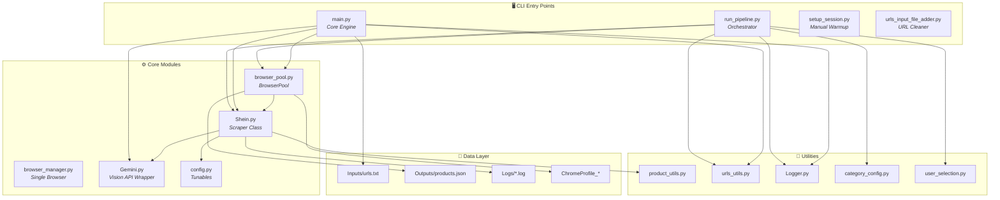
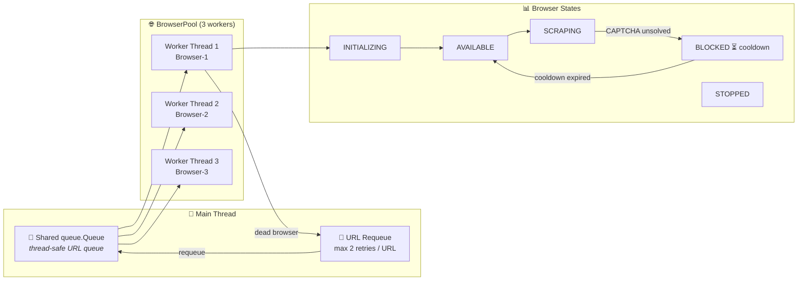
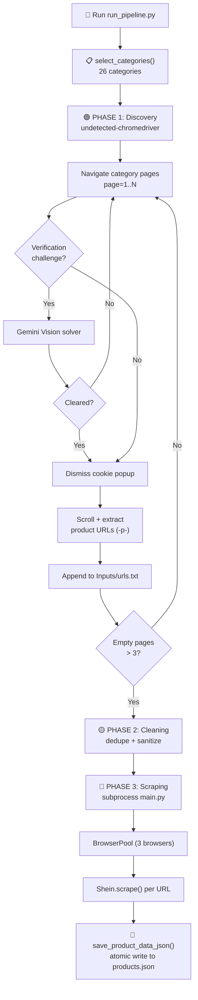
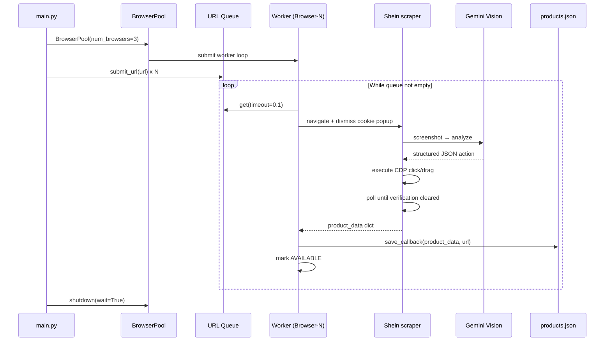
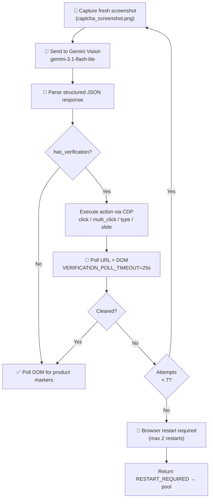

<p align="center">
  
  
  
  
  
</p>

<h1 align="center">🛍️ SHEIN Web Scraper</h1>

<p align="center">
  <strong>An automated, AI-powered product scraper for SHEIN US</strong><br>
  <em>Anti-detection browsing · Gemini Vision CAPTCHA solving · Concurrent 3-browser pool · Structured JSON output</em>
</p>

<p align="center">
  
  
  
  
</p>


## 📌 Executive Summary

**SHEIN Web Scraper** is a Python-based engineering project that automates the end-to-end collection of product data — names, prices, discounts, descriptions, sizes, SKUs, reviews, and shipping flags — from **SHEIN US** product pages at scale.

The system is built around three pillars:

1. **Realistic browsing** — `undetected-chromedriver` (with Playwright as a fallback) and persistent Chrome profiles avoid bot detection.
2. **AI-powered verification handling** — Google **Gemini Vision** analyzes screenshots and drives CDP mouse events to solve CAPTCHA/verification challenges automatically.
3. **Concurrent, fault-tolerant scraping** — a thread-safe `BrowserPool` runs **3 reusable Chrome instances** in parallel, with automatic CAPTCHA blocking/cooldown, dead-browser recovery, URL requeueing, and incremental JSON persistence.

The project is a complete 3-phase pipeline: **Mass URL Discovery → URL Cleaning → Mass Scraping**, and is designed to scale to **10,000+ product URLs** while protecting results against data loss at every step.


## 🎯 Project Goals

| Goal | How it is achieved |
|------|--------------------|
| Automate product data collection at scale | 3-phase pipeline (Discovery → Cleaning → Scraping) with a concurrent `BrowserPool` |
| Evade bot detection reliably | `undetected-chromedriver` + anti-detection flags + persistent Chrome profiles |
| Solve CAPTCHAs automatically | Gemini Vision AI reads screenshots and returns structured click/drag actions executed via CDP |
| Never lose scraped data | Incremental, atomic writes to `Outputs/products.json` with duplicate-URL detection |
| Handle anti-bot blocking gracefully | Browser status tracking, cooldown, URL requeueing, and automatic browser recreation |
| Provide structured, analyst-friendly output | Unified JSON schema with prices split into integer/decimal parts and structured descriptions |
| Document the engineering decisions | Comprehensive README, module docstrings, and centralized configuration |


## ✨ Project Highlights

> ✅ = Implemented and verified in the repository

- ✅ **AI-powered CAPTCHA solving** — Gemini Vision + CDP mouse events
- ✅ **Concurrent BrowserPool** — 3 reusable Chrome instances running in parallel
- ✅ **Thread-safe architecture** — `threading.Lock`, `queue.Queue`, `ThreadPoolExecutor`
- ✅ **Automatic browser recovery** — dead browsers are detected and recreated
- ✅ **Persistent Chrome profiles** — `ChromeProfile/`, `ChromeProfile_1..3`, `ChromeProfile_Discovery`
- ✅ **Duplicate URL detection** — already-scraped URLs are skipped via `products.json`
- ✅ **Incremental JSON saving** — atomic write (`.tmp` + `os.replace`) after every product
- ✅ **10,000+ product scalable design** — configurable `--target` (default 10,000)
- ✅ **Gemini API key rotation** — multiple `Name:Key` keys with automatic rotation on quota exhaustion
- ✅ **Manual session warmup fallback** — `setup_session.py` for human-assisted CAPTCHA clearing
- ✅ **Dual-channel logging** — colored console output + ANSI-stripped log files


## 📊 Repository Statistics

| Attribute | Value |
|-----------|-------|
| **Language** | Python (>= 3.8) |
| **Architecture** | Multi-threaded (thread pool + shared queue) |
| **Browser Engine** | undetected-chromedriver (Playwright fallback) |
| **AI** | Google Gemini Vision (`google-genai`) |
| **Output Format** | JSON (`Outputs/products.json`) |
| **Target Website** | SHEIN US (`us.shein.com`) |
| **Concurrency** | 3 browsers (default) |
| **CAPTCHA Model** | `gemini-3.1-flash-lite` |
| **Pipeline Phases** | 3 (Discovery → Cleaning → Scraping) |
| **Supported Categories** | 26 main SHEIN categories |


## 🏗️ Project Structure

```text
shein_web_scraper_testing/
├── main.py                   # Core execution engine — orchestrates BrowserPool + saving
├── run_pipeline.py           # End-to-end orchestrator: Discovery → Cleaning → Scraping
├── Shein.py                  # Main scraper class — page loading, parsing, CAPTCHA solving
├── browser_pool.py           # Thread-safe pool of reusable Chrome instances (concurrency)
├── browser_manager.py        # Simple single-browser lifecycle manager
├── Gemini.py                 # Google Gemini API wrapper (Vision CAPTCHA solving)
├── config.py                 # Centralized verification/challenge handling configuration
├── category_config.py        # 26 SHEIN main category names and URLs
├── user_selection.py         # Interactive category selection for the discovery phase
├── setup_session.py          # Manual session warmup (solve CAPTCHAs by hand, save session)
├── product_utils.py          # Filesystem-safe product name normalization
├── urls_utils.py             # URL preprocessing helpers (clean, dedupe, sort, backup)
├── urls_input_file_adder.py  # Standalone URL cleaning/deduplication utility
├── Logger.py                 # Dual-channel logger (terminal + ANSI-stripped log file)
├── requirements.txt          # Python dependencies
├── .env                      # Environment variables (GEMINI_API_KEY) — not committed
├── .gitignore                # Ignored runtime artifacts
├── ChromeProfile/            # Persistent Chrome profile (created at runtime)
├── ChromeProfile_1..3/       # Per-browser profiles used by BrowserPool (runtime)
├── Inputs/
│   ├── urls.txt              # Product URLs to scrape (one per line, # = comment)
│   └── urls-backup.txt       # Automatic backup copy of urls.txt
├── Logs/                     # Dual-channel log files (created at runtime)
└── Outputs/
    ├── products.json         # Accumulated scraped product data (JSON array)
    └── .staging/             # Temporary staging area during runs
```


## 🔧 Technologies Used

| Technology | Purpose |
|------------|---------|
| [undetected-chromedriver](https://github.com/undetected-chromedriver/undetected-chromedriver) 3.5.5 | Anti-detection browser automation |
| [Playwright](https://playwright.dev/python/) 1.51 + `playwright-stealth` | Fallback browser automation engine |
| [Selenium](https://www.selenium.dev/) 4.46 | CDP mouse events & WebDriver control |
| [BeautifulSoup 4](https://www.crummy.com/software/BeautifulSoup/) 4.14 | HTML parsing & product data extraction |
| [google-genai](https://github.com/googleapis/python-genai) 1.61 | Gemini Vision API for CAPTCHA analysis |
| [python-dotenv](https://github.com/theskumar/python-dotenv) 1.2 | `.env` configuration loading |
| [colorama](https://pypi.org/project/colorama/) 0.4 | Colored terminal output |
| [tqdm](https://github.com/tqdm/tqdm) 4.67 | Progress reporting |
| [opencv-python](https://opencv.org/) / [pillow](https://python-pillow.org/) / [PyAutoGUI](https://github.com/asweigart/pyautogui) | Image / screenshot support |
| [requests](https://requests.readthedocs.io/) / [httpx](https://www.python-httpx.org/) | HTTP layer used by the SDKs |


## 📋 Requirements

- Python **3.11 (Recommended)**
- Google Chrome
- Playwright Chromium
- Google Gemini API Key

> **Important**
>
> This project has been developed and tested using **Python 3.11**.
> Some third-party libraries (such as `undetected-chromedriver` and `pydantic-core`) may not yet support Python 3.12+ / 3.13 / 3.14.
> For the best compatibility, create the virtual environment using **Python 3.11**.


# 🚀 Quick Start

Follow these steps to set up and run the SHEIN Web Scraper on a new system.

## Step 1 — Clone the Repository

```bash
git clone https://github.com/Abhiram126/shein-web-scraper.git
cd shein-web-scraper
```

## Step 2 — Create a Virtual Environment

### Windows

```bash
python -m venv venv
venv\Scripts\activate
```

### Linux / macOS

```bash
python3 -m venv venv
source venv/bin/activate
```

## Step 3 — Install Dependencies

Install all required Python packages.

```bash
pip install -r requirements.txt
```

Install the Playwright browser:

```bash
playwright install chromium
```

## Step 4 — Configure the `.env` File

Create a `.env` file in the project root.

```bash
copy .env.example .env
```

### Single API Key

```env
GEMINI_API_KEY=your_gemini_api_key_here
```

### Multiple API Keys (Recommended)

```env
GEMINI_API_KEY=OwnerA:KEY_A,OwnerB:KEY_B,OwnerC:KEY_C
```

> **Tip:** Legacy comma-separated API keys are also supported and will be automatically named (`key_1`, `key_2`, ...).

### Optional Environment Variables

| Variable | Description |
|----------|-------------|
| `CHROME_EXECUTABLE_PATH` | Path to a custom Chrome executable |
| `CHROME_PROFILE_PATH` | Path to an existing Chrome profile |
| `HEADLESS` | Set to `true` to run headless (default: `false`) |
| `BROWSER_PROXY` | Optional proxy server for browser instances |

## Step 5 — Warm Up a Chrome Profile (Recommended)

Run:

```bash
python setup_session.py
```

If SHEIN displays a cookie consent popup or a verification page (CAPTCHA):

- Click **Reject All Cookies** (if prompted).
- Complete the verification manually.
- Wait until a normal product page loads.
- Press **ENTER** in the terminal.

The authenticated Chrome session will be saved inside the `ChromeProfile/` directory and reused by future scraping sessions.

> **Note:** This step usually needs to be performed only once. After the initial session is saved, the scraper automatically reuses the Chrome profile and attempts to solve future verification challenges using Gemini Vision AI. 

## Step 6 — Run the Complete Pipeline

```bash
python run_pipeline.py --target 100
```

The application will prompt you to select one or more SHEIN categories.

Example:

```text
========================================================
           Available SHEIN Categories
========================================================

 1.  New In
 2.  Sale
 3.  Women Clothing
 4.  Men Clothing
 5.  Kids
 6.  Curve
 7.  Home & Living
 8.  Beauty
 9.  Jewelry & Accessories
10.  Shoes
11.  Bags & Luggage
12.  Sports & Outdoor
...
26. All Categories

========================================================

Select one or more categories by entering their numbers.

Examples:

1
→ Scrape only Category 1

1 3 5
→ Scrape Categories 1, 3, and 5

1,3,5
→ Comma-separated input is also supported

all
→ Scrape all 26 categories
```

After category selection, the pipeline executes automatically.

### Phase 1 — URL Discovery

- Opens selected category pages
- Handles cookie popups
- Solves verification pages using Gemini Vision
- Discovers product URLs
- Saves them into:

```
Inputs/urls.txt
```

### Phase 2 — URL Cleaning

The discovered URLs are:

- Cleaned
- Deduplicated
- Sorted
- Validated

### Phase 3 — Product Scraping

The scraper:

- Starts the BrowserPool
- Launches three concurrent Chrome browsers
- Solves verification pages automatically
- Extracts product information
- Continuously writes results to:

```
Outputs/products.json
```

# 🧑‍💻 Usage Reference

## Option A — Full Automated Pipeline (Recommended)

```bash
python run_pipeline.py
```

| Command | Description |
|---------|-------------|
| `python run_pipeline.py --target 1000` | Stop URL discovery after 1000 URLs |
| `python run_pipeline.py --out custom_urls.txt` | Save discovered URLs to a custom file |
| `python run_pipeline.py --categories file.txt` | CLI option exists, but category file loading is currently disabled. Categories are selected interactively. |

---

## Option B — Scrape Existing URLs

Place product URLs inside:

```
Inputs/urls.txt
```

Run:

```bash
python main.py
```

### Available Options

| Command | Description |
|---------|-------------|
| `python main.py --verbose` | Enable verbose logging |
| `python main.py --target 10` | Scrape only the first 10 URLs |

---

## Option C — Clean the URL List

```bash
python urls_input_file_adder.py
```


## 🧠 Architecture Overview

The system is split into three cooperating layers:



### BrowserPool Architecture



### Complete Pipeline Flow



### UML Sequence Diagram — Concurrent Scraping




## 🧵 Threading & Concurrency Model

- **1 main thread** submits all URLs into a shared `queue.Queue`.
- **3 worker threads** (via `ThreadPoolExecutor`, `thread_name_prefix="BrowserWorker"`) each own exactly one Chrome instance.
- Browser state (`status`, `blocked_until`, `current_url`) is guarded by a `threading.Lock` (`browser_lock`).
- URL retry counts are guarded by a separate `retries_lock`.
- Processed counters use `_processed_lock` to avoid race conditions.
- Each browser uses its **own profile directory** (`ChromeProfile_1`, `ChromeProfile_2`, `ChromeProfile_3`) to avoid Chrome profile-lock conflicts.
- Browser instances are created **sequentially** at startup (`uc.Chrome` is not thread-safe for creation).

> ⚠️ **Important:** Browser creation is intentionally serialized — `uc.Chrome` cannot be instantiated concurrently.


## 🧠 How It Works — CAPTCHA Solving

### Gemini Vision CAPTCHA Workflow



### Detailed Steps

1. The page is loaded with anti-detection flags (persistent Chrome profile, `--disable-blink-features=AutomationControlled`, etc.).
2. Cookie consent popups are dismissed via aggressive CSS/JS injection (no API call needed).
3. A fresh screenshot is captured and sent to **Gemini Vision**.
4. Gemini returns a **structured JSON** action plan:
  ```json
[
  {
    "url": "https://us.shein.com/1-10-5pcs-Women-s-Keychain-Back-To-School-Gift-Couple-Gift-Birthday-Gift-Wedding-Gift-Holiday-Gift-Party-Favor-Event-Souvenir-Friend-Gift-Bag-Accessory-Car-Accessory-Creative-Teacher-Sister-Gift-Valentine-s-Day-1pc-Handmade-Woven-Cross-Keychain-Jesus-Keychain-Christian-Car-Keychain-Bag-Accessory-Soft-Cross-Keychain-Ring-Bohemian-Decor-Suitable-For-Men-And-Women-Holiday-Decor-Birthday-Gift-p-419770771.html",
    "name": "1 - 10 - 5Pcs Women'S Keychain Back To School Gift Couple Gift Birthday Gift",
    "product_name_safe": "1 - 10 - 5Pcs Women'S Keychain Back To School Gift Couple Gift Birthday Gift",
    "sku": "sc260312135042897623580",
    "reviews": "5.00 5.00 Review Policy Top Score in Keyrings & Ke",
    "available_sizes": [
      "5pcs",
      "Pink 1pc",
      "Purple 1pc",
      "Send 5 Pieces Of Random Color",
      "Send 10 Pieces Of Color Randomly",
      "1 White Piece"
    ],
    "current_price_integer": "2",
    "current_price_decimal": "00",
    "old_price_integer": "2",
    "old_price_decimal": "20",
    "discount_percentage": "9%",
    "description": "Details:multiple accessoriespattern type:letter, plantsfestivals:non-holidaycolor:multicolormaterial:zinc alloystyle:casualelement:cartoonsku:sc260312135042897623580\n\nDescription\n\nNo Other Material,Non-Holiday,Plants,Letter\n\nDetails: Multiple Accessories Pattern Type: Letter, Plants Festivals: Non-Holiday Color: Multicolor Material: Zinc Alloy Style: Casual Element: Cartoon SKU: sc260312135042897623580\n\nDetails: Multiple Accessories\n\nDetails:\n\nMultiple Accessories\n\nPattern Type:\n\nLetter, Plants\n\nFestivals:\n\nNon-Holiday\n\nColor:\n\nMulticolor\n\nMaterial:\n\nZinc Alloy\n\nStyle:\n\nCasual\n\nElement:\n\nCartoon\n\nSKU:\n\nsc260312135042897623580",
    "description_structured": {
      "text": "Details:multiple accessoriespattern type:letter, plantsfestivals:non-holidaycolor:multicolormaterial:zinc alloystyle:casualelement:cartoonsku:sc260312135042897623580\n\nDescription\n\nNo Other Material,Non-Holiday,Plants,Letter\n\nDetails: Multiple Accessories Pattern Type: Letter, Plants Festivals: Non-Holiday Color: Multicolor Material: Zinc Alloy Style: Casual Element: Cartoon SKU: sc260312135042897623580\n\nDetails: Multiple Accessories\n\nDetails:\n\nMultiple Accessories\n\nPattern Type:\n\nLetter, Plants\n\nFestivals:\n\nNon-Holiday\n\nColor:\n\nMulticolor\n\nMaterial:\n\nZinc Alloy\n\nStyle:\n\nCasual\n\nElement:\n\nCartoon\n\nSKU:\n\nsc260312135042897623580",
      "attributes": {
        "Details": "Multiple Accessories Pattern Type: Letter, Plants Festivals: Non-Holiday Color: Multicolor Material: Zinc Alloy Style: Casual Element: Cartoon SKU: sc260312135042897623580",
        "Pattern Type": "Letter, Plants",
        "Festivals": "Non-Holiday",
        "Color": "Multicolor",
        "Material": "Zinc Alloy",
        "Style": "Casual",
        "Element": "Cartoon",
        "SKU": "sc260312135042897623580"
      }
    },
    "is_international": false
  },
```
5. The action is executed via **CDP mouse events** (with `ActionChains` fallback for Selenium).
6. The page is **polled** (`VERIFICATION_POLL_INTERVAL` / `VERIFICATION_POLL_TIMEOUT`) until the URL no longer contains verification patterns and the DOM shows product markers.
7. On repeated failure, the browser is restarted (`BROWSER_RESTART_THRESHOLD`, `MAX_CONSECUTIVE_RESTARTS`), or the URL is requeued / the browser is cooled down.

### Verification Detection Signals

| Signal | Mechanism |
|--------|-----------|
| URL patterns | `captcha`, `challenge`, `verify`, `security-check`, `turnstile` |
| DOM keywords | `"verify you are human"`, `"slide to complete"`, `"i'm not a robot"`, `"turnstile"` |
| Product page markers | `productintro`, `add to bag`, `sku`, `productMainPriceId`, `fsp-element` |


## 📦 Data Extraction Strategy

### Price extraction (3 fallback layers)

1. **JSON-first** — `promotionInfoPrice.amountWithSymbol` and `originalPrice.amountWithSymbol` from embedded `<script type="application/json">`.
2. **HTML selectors** — centralized `HTML_SELECTORS` dictionary in `Shein.py`.
3. **Computational fallback** — old price derived from `current_price / (1 - discount%)`.

Brazilian currency format (`R$2.299,08`) is normalized into separate integer and decimal parts (`("2299", "08")`).

---

# 📈 Results

The scraper has been successfully tested on both small-scale and long-running scraping sessions.

### Successfully Verified

- ✅ Single product scraping
- ✅ Multiple concurrent browser sessions
- ✅ BrowserPool with 3 reusable Chrome instances
- ✅ Automatic duplicate URL detection
- ✅ Incremental product saving
- ✅ Automatic browser recovery
- ✅ Gemini Vision CAPTCHA solving
- ✅ URL preprocessing and cleaning
- ✅ Long-running scraping sessions with continuous data collection

The scraper writes every successfully extracted product directly into **Outputs/products.json**, allowing progress to be preserved throughout execution.

---

## 📦 Output

The scraper stores all extracted product information in:

- **[`Outputs/products.json`](./Outputs/products.json)**

You can open this file to verify the scraper's output. It contains a JSON array of all successfully scraped SHEIN products, including product details, pricing, sizes, reviews, descriptions, and structured attributes.

Every successfully scraped product is appended to this file using the unified product schema.

To verify the total number of scraped products at any time, run:

```bash
python -c "import json; print(len(json.load(open('Outputs/products.json', encoding='utf-8'))))"
```

Example:

```text
159
```

This indicates that **159 products** have been successfully extracted and stored.

The `Outputs/products.json` file serves as the primary artifact for validating scraper execution and reviewing the extracted product information.

---

# ⚠️ Challenges Faced During Development

Developing a reliable scraper for SHEIN required overcoming several engineering challenges due to modern anti-bot mechanisms and dynamic web content.

| Challenge | Solution Implemented |
|-----------|----------------------|
| Dynamic page loading | Multiple extraction strategies with JSON-first and HTML fallback parsing |
| Modern anti-bot protection | Gemini Vision analyzes verification pages and generates structured actions executed through CDP |
| Browser crashes during long scraping sessions | Automatic browser recreation inside BrowserPool |
| Duplicate products | Duplicate URL detection before writing into `products.json` |
| Concurrent scraping | Thread-safe BrowserPool using `ThreadPoolExecutor`, `queue.Queue`, and synchronization locks |
| Long-running scraping jobs | Incremental product saving after every successful scrape to minimize data loss |
| CAPTCHA interruptions | Automatic verification handling with optional manual warm-up for difficult cases |
| Scaling to thousands of URLs | BrowserPool architecture with reusable browser instances and URL requeueing |

---

# ⚠️ Limitations

Although the scraper is designed to operate autonomously, some limitations are inherent when scraping websites protected by modern anti-bot systems.

- SHEIN may occasionally present new verification challenges that cannot always be solved automatically on the first attempt.
- During long scraping sessions, the first verification challenge may sometimes require **manual completion**.
- After manually solving the initial verification, the saved Chrome profile is reused and the scraper generally continues automatically for an extended period.
- Manual verification is **not required for every product**. It only occurs occasionally depending on SHEIN's security mechanisms.
- Automatic CAPTCHA solving depends on valid Google Gemini API keys and their available quota.
- Significant changes to SHEIN's website structure or anti-bot mechanisms may require updates to HTML selectors or verification logic.
- Overall scraping performance depends on network stability, browser stability, and the response time of the target website.

> **Note**
>
> Occasional manual verification is an expected characteristic of scraping websites protected by advanced anti-bot systems and should not be considered a failure of the scraper.

---

# 📌 Assumptions

This project assumes the following conditions:

- Google Chrome is installed on the target system.
- Python dependencies have been installed using `requirements.txt`.
- One or more valid Google Gemini API keys are configured in the `.env` file.
- Internet connectivity is stable.
- SHEIN product URLs are valid and accessible.
- The website structure has not changed significantly since development.

---

# 🔮 Future Improvements

Potential enhancements include:

- Automatic image downloading.
- CSV and Excel export options.
- Database integration (PostgreSQL / MongoDB).
- Distributed scraping across multiple machines.
- Proxy rotation support.
- Docker containerization.
- Resume interrupted scraping sessions automatically.
- Interactive web dashboard for monitoring BrowserPool status.
- Automatic adaptation to new CAPTCHA layouts using improved AI models.

---

# 📚 Resources

- SHEIN US — https://us.shein.com/
- Google Gemini API — https://ai.google.dev/
- Selenium Documentation — https://www.selenium.dev/documentation/
- Playwright Documentation — https://playwright.dev/python/
- BeautifulSoup Documentation — https://www.crummy.com/software/BeautifulSoup/
- undetected-chromedriver — https://github.com/ultrafunkamsterdam/undetected-chromedriver

---

# 🙏 Acknowledgements

This project was developed as part of a technical engineering assignment focused on designing a scalable, AI-assisted web scraping system capable of handling modern anti-bot protected e-commerce websites while maintaining structured, reliable, and incremental data collection.

## 🔗 Repository

**GitHub Repository:**  
[Abhiram126/shein-web-scraper](https://github.com/Abhiram126/shein-web-scraper)
